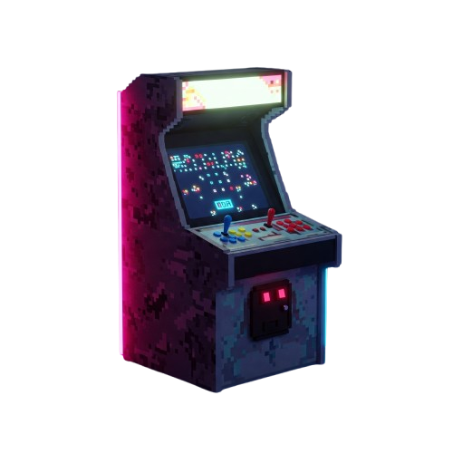
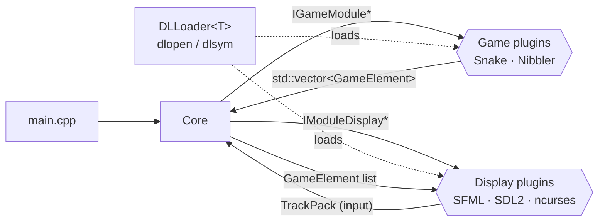

<p align="center">
  
</p>

<h1 align="center">Arcade</h1>

<p align="center">
  <em>One core, many games, many renderers — all swapped at runtime.</em><br/>
  C++17 · dynamic libraries (<code>dlopen</code>) · SFML · SDL2 · ncurses
</p>

---

## Overview

**Arcade** is a gaming platform written in C++: a small *core* program loads **games** and **graphics libraries** as shared objects (`.so`) at runtime. While playing, you can switch from a terminal renderer (ncurses) to a windowed one (SFML or SDL2) — or jump to another game — **without restarting the program**.

The whole point of the project is architecture: the core never knows which game or renderer it is talking to. It only speaks to two interfaces.

| Plugins            | Library file                |
| ------------------ | --------------------------- |
| Snake              | `lib/arcade_snake.so`       |
| Nibbler            | `lib/arcade_nibbler.so`     |
| SFML renderer      | `lib/arcade_sfml.so`        |
| SDL2 renderer      | `lib/arcade_sdl2.so`        |
| ncurses renderer   | `lib/arcade_ncurses.so`     |

## Architecture



- **`IGameModule`** (`IModuleGame.hpp`) — the game logic: `init`, `update`, `handleInput(TrackPack)`, `getGameState()`, `getScore()`, `isGameOver()`, `setpaused()`, `destroy()`.
- **`IModuleDisplay`** (`IModuleDisplay.hpp`) — the renderer: `init`, `update`, `draw`, `getEvent`, menu drawing, `clean`.
- **`GameElement`** — the only data exchanged between a game and a renderer: *what* to draw and *where*, never *how*. That is what makes a Snake board drawable in a terminal or in a window.
- **`TrackPack`** — a library-agnostic enumeration of inputs (`UP`, `LEFT`, `LIB_RIGHT`, `PAUSE`…), so games never depend on SFML or SDL key codes.
- **`DLLoader<T>`** (`loader.hpp`) — opens a shared object with `dlopen`, resolves the `extern "C"` factory `createInstance` with `dlsym`, and releases it through `destroyInstance`.

Each plugin exposes the same two C symbols, which keeps C++ name mangling out of the contract:

```cpp
extern "C" IGameModule *createInstance();
extern "C" void destroyInstance(IGameModule *instance);
```

## Build

### Dependencies (Ubuntu / Debian)

```bash
sudo apt install g++ make libsfml-dev libsdl2-dev libsdl2-image-dev libsdl2-ttf-dev libncurses-dev
```

### Compile

```bash
make            # core + games + graphics libraries
make core       # only the ./arcade binary
make games      # lib/arcade_snake.so, lib/arcade_nibbler.so
make graphicals # lib/arcade_sfml.so, lib/arcade_sdl2.so, lib/arcade_ncurses.so
make fclean     # remove every build output
```

## Run

The core takes the graphics library to start with:

```bash
./arcade ./lib/arcade_sfml.so
./arcade ./lib/arcade_sdl2.so
./arcade ./lib/arcade_ncurses.so
```

### Controls

| Key            | Action                              |
| -------------- | ----------------------------------- |
| Arrow keys     | Move                                |
| `L` / `R`      | Previous / next graphics library    |
| `U` / `D`      | Previous / next game                |
| `M`            | Back to the menu                    |
| `N`            | Restart the game                    |
| `P`            | Pause                               |
| `A`            | Quit                                |

Maps and saves are plain text files at the root: `SnakeConfig.txt`, `SnakeSave.txt`, `NibblerConfig.txt`, `NibblerSave.txt`, and `gameover.txt` for the end screen.

## Documentation

The sources are documented with Doxygen comments:

```bash
sudo apt install doxygen graphviz
doxygen          # reads ./Doxyfile, writes docs/html/index.html
```

Design notes from the beginning of the project are kept in [`docs/game-module-design-notes.txt`](docs/game-module-design-notes.txt).

## What I learned

- Designing **interfaces first**: once `IGameModule` and `IModuleDisplay` were frozen, the three of us could work on games and renderers in parallel.
- The details of **dynamic loading** in C++: `extern "C"` factories, symbol resolution, object lifetime across library boundaries, and why a plugin must be destroyed by the library that created it.
- Writing the same rendering logic for three very different back-ends (a terminal grid, SFML sprites, SDL textures).

## Team

Epitech project (B-OOP-400), 2025.

- **Amour Guidi** — [@amourguidi](https://github.com/amourguidi)
- **Oscar Gbenou** — [@racso27th](https://github.com/racso27th)
- **Aïmane Alassane** — [@d4rk-sid3](https://github.com/d4rk-sid3) · SDL2 renderer, graphical menu and its integration in the core and the three renderers

The full commit history of the original school repository is preserved here, with every author.
